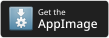

# Flare
[](https://github.com/DimensionDev/Flare/blob/master/LICENSE)
[](https://crowdin.com/project/flareapp)
[](https://deepwiki.com/DimensionDev/Flare)
[](https://t.me/+0UtcP6_qcDoyOWE1)
[](https://discord.gg/De9NhXBryT)


Flare is an open-source, privacy-first social client that brings Mastodon, Misskey, Bluesky, X, and RSS into one unified timeline. It supports cross-posting, lists, feeds, DMs, RSS management, and AI-powered features such as translation and summaries. Built with Kotlin Multiplatform, Flare shares its core logic across Android, iOS, macOS, Windows, and Linux, turning fragmented social feeds into a personal information hub.

<a href="https://apps.microsoft.com/detail/9NLRN0BKZ357?referrer=appbadge&mode=direct">
	
</a>
<a href='https://apps.apple.com/us/app/flare-social-network-client/id6476077738'></a>
<a href='https://play.google.com/store/apps/details?id=dev.dimension.flare&pcampaignid=pcampaignidMKT-Other-global-all-co-prtnr-py-PartBadge-Mar2515-1'></a>
<a href='https://f-droid.org/packages/dev.dimension.flare'></a>
<a href='https://github.com/DimensionDev/Flare/releases/latest'></a>

## Features
 - Unified social inbox: Flare brings Mastodon, Misskey, Bluesky, X, and RSS together in one place, so users can follow fragmented communities through a single timeline.
 - Mixed timeline experience: It merges content from multiple accounts and platforms into a coherent feed, reducing context switching between apps.
 - Cross-platform by design: Built with Kotlin Multiplatform, Flare shares core logic across Android, iOS, macOS, Windows, and Linux.
 - Rich platform support: Beyond basic timelines, it supports features such as polls, lists, bookmarks/favorites, Misskey antennas, Bluesky feeds and DMs, and RSS management.
 - Cross-posting workflow: Users can publish to multiple platforms at once, making it practical for creators and heavy social media users.
 - AI-assisted reading: Flare includes AI-powered capabilities such as translation and summaries to help users catch up on content faster.
 - Privacy-first approach: As a FOSS client, it emphasizes user control with features like anonymous mode, local filtering, local history, and transparent data handling.

## Roadmap
Here're some features we're planning to implement in the future.
 - [x] Grouped Mixed timeline
 - [ ] Showing instance's announcement
 - [ ] Crossposting for repost
 - [ ] Auto thread
 - [ ] AI powered features
   - [ ] Personal trends of the day
   - [ ] Quick reply
 - [ ] Support for Meta Threads
 - [ ] Support for Discourse forum
 - [x] Desktop Client
 - [ ] Web Client(?)

Here're some features we've done before.
 - [x] Mixed timeline
 - [x] AI powered features
   - [x] Translation
   - [x] Summary
 - [x] Anonymous mode enhancement, option to change data source
 - [x] Local history
 - [x] RSS feed support
 - [x] Support for vvo platform
 - [x] Anonymous mode, no need to login
 - [x] Customizable tabs
 - [x] Local filtering
 - [x] Crossposting
 - [x] Translation

### Mastodon
 - [x] Support for polls
 - [x] Support global/local timelines
 - [x] Support for lists
 - [x] Support for bookmarks/faovrites timelines

### Misskey
 - [x] Support for polls
 - [x] Support for lists
 - [x] Support for antennas
 - [x] Support for faovrites timeline

### Bluesky
 - [x] Support for lists
 - [x] Support for feeds
 - [x] Support DM

## Building
### Android
 - Make sure you have JDK(JBR) 25 installed
 - Run `./gradlew installDebug` to build and install the debug version of the app
 - You can open the project in Android Studio or IntelliJ IDEA if you want

### iOS
 - Make sure you have JDK(JBR) 25 installed
 - Make sure you have a Mac with Xcode 26 installed
 - open `iosApp/Flare.xcodeproj` in Xcode
 - Build and run the app

### Server
 - Flare Server uses Ktor with Kotlin Native, which only works on Linux X64 and MacOS X64/ARM64
 - Make sure you have JDK 25(JBR) installed
 - Run `./gradlew :server:runDebugExecutableMacosArm64 -PrunArgs="--config-path=path/to/server/src/commonMain/resources/application.yaml"` to build and run the server, remember to replace `path/to/server/src/commonMain/resources/application.yaml` with the path to your config file
 - The server will run on `http://localhost:8080` by default
#### Docker
If you prefer using Docker, you can use Docker Compose to run prebuild Server Image.
 - Rename `.env.sample` to `.env`, and update the environment variables in the file.
 - If you're deploying into a production server, you might need to update the `docker-compose.yml` file with these lines:
   ```diff
   environment:
   -   # STAGE: local
   +   STAGE: 'production'
   -   DOMAINS: api.flareapp.moe -> http://flare-backend:8080
   +   DOMAINS: your_domain_here -> http://flare-backend:8080
   ```
 - Run `docker compose up -d`

### Desktop
 - Make sure you have JDK(JBR) 25 installed
 - Run `./gradlew run` to build and run the debug version of the desktop app.

## Contributing
See [CONTRIBUTING.md](CONTRIBUTING.md) for more information.

## License
This project is licensed under the [AGPL-3.0](LICENSE) license.
